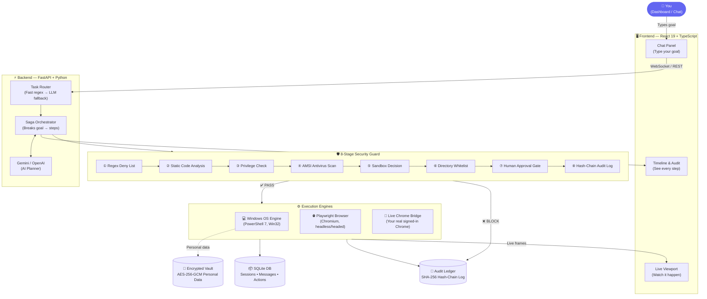

<div align="center">
  <h1>⚡ DirectAct-AI</h1>
  <p><strong>Turn natural language into real desktop & web actions — with a built-in AI security firewall.</strong></p>

  <p>
    
    
    
    
    
    
  </p>

  <p>
    <a href="#-quick-start">🚀 Quick Start</a> •
    <a href="#-architecture">🏗 Architecture</a> •
    <a href="#-how-it-works">⚙️ How It Works</a> •
    <a href="#-security">🔒 Security</a> •
    <a href="#%EF%B8%8F-configuration">🛠️ Config</a>
  </p>
</div>

---

## 💡 What Is DirectAct-AI?

DirectAct-AI is an **autonomous AI agent** that listens to what you want in plain English and performs the action on your computer — across websites and desktop apps — safely.

```
You say  →  "Find cheapest flight from Mumbai to Delhi next week and tell me the price"
AI does  →  Opens browser → Navigates to Google Flights → Fills form → Reads results → Reports back
You see  →  Every step, live, in your browser dashboard
```

Unlike other AI agents that blindly run code, DirectAct-AI runs **every action through an 8-stage security checkpoint** before touching your system. Risky actions pause and ask for your approval.

---

## 🏗 Architecture



---

## ⚙️ How It Works

### Step-by-Step Flow

| Step | What Happens |
|------|-------------|
| **1. You type a goal** | Natural language — no code needed |
| **2. Task Router** | Classifies intent in <5ms (regex). Falls back to LLM if ambiguous |
| **3. AI Planner** | Gemini/OpenAI breaks the goal into typed action steps (not raw code) |
| **4. Security Guard** | Each step passes through 8 deterministic safety stages |
| **5. Execution** | Approved steps run on OS engine or browser engine |
| **6. Live stream** | You watch the browser/desktop live in the viewport panel |
| **7. Audit log** | Every decision is permanently hash-chained and stored |

### The Two Execution Modes

```
Mode 1 — Playwright Browser (Isolated)
  ├── Opens a fresh Chromium window
  ├── Highlights elements with a red outline before clicking
  └── Streams live screenshots to your dashboard

Mode 2 — Live Chrome Bridge (Your Chrome)
  ├── Chrome Extension connects via chrome.debugger API
  ├── Works inside your real signed-in session (Gmail, GitHub…)
  └── Never reads your passwords or cookies
```

---

## 🔒 Security

DirectAct-AI's core principle: **the LLM never touches your OS directly.**

```
LLM Output  →  Typed Schema Actions  →  8-Stage Guard  →  OS / Browser
             (not raw shell scripts)    (deterministic)
```

### The 8-Stage Guard — What Each Stage Blocks

| # | Stage | Blocks |
|---|-------|--------|
| **①** | Policy Deny List | `rm -rf`, `format C:`, `shutdown`, `del /s`, PowerShell bypasses |
| **②** | Static Analysis | Hidden windows, obfuscated payloads, download cradles |
| **③** | Privilege Check | `sudo`, `runas`, `net localgroup administrators` |
| **④** | AMSI Antivirus | Every script scanned by Windows Defender in-memory |
| **⑤** | Sandbox Decision | Unknown executables routed to Windows Sandbox VM |
| **⑥** | Directory Whitelist | No writes to `C:\Windows`, `C:\Program Files`, system dirs |
| **⑦** | Human Approval | **YOU** click Approve/Decline for any medium-high risk action |
| **⑧** | Audit Log | SHA-256 hash-chained — modifying history breaks the chain |

### Encrypted Personal Vault

Your personal data (name, email, address) is stored in an AES-256-GCM encrypted vault. The master key lives **only in your OS Keychain** — never written to disk.

| Data Tier | Examples | Access |
|-----------|----------|--------|
| Routine | Name, preferences | Auto-approved |
| Contextual | Email, phone, address | Approved if task purpose matches |
| Identity | ID references | Requires explicit confirmation every time |
| **Forbidden** | Passwords, credit cards, CVVs | **Hard blocked at write time** |

---

## 🚀 Quick Start

### Prerequisites
- Windows 10 / 11
- Python 3.10+
- Node.js 18+

### One Command

```powershell
.\start.ps1
```

> Automatically installs dependencies, sets up `.env`, installs Playwright, and starts both servers.

| | URL |
|---|---|
| 🖥️ Dashboard | http://localhost:5173 |
| 📖 API Docs | http://localhost:8000/docs |

---

### Manual Setup

<details>
<summary><strong>Click to expand manual steps</strong></summary>

**Backend**
```powershell
cd backend
python -m venv .venv
.\.venv\Scripts\Activate.ps1
pip install -r requirements.txt
python -m playwright install chromium
copy .env.example .env
# Open .env and add your GEMINI_API_KEY
uvicorn app.main:app --port 8000 --reload
```

**Frontend** (new terminal)
```powershell
cd frontend
npm install
npm run dev
```

</details>

---

### 🧩 Chrome Extension (Live Mode Setup)

Control your real Chrome session (useful for sites where you're already logged in):

1. Open Chrome → `chrome://extensions`
2. Enable **Developer mode** (top right)
3. Click **Load unpacked** → select the `chrome-extension/` folder
4. Visit `http://localhost:8000/api/v1/chrome/bridge-status` → confirm `"connected": true`

---

## 🛠️ Configuration

Edit `backend/.env` (copy from `.env.example`):

```env
# Required
GEMINI_API_KEY=your_key_here     # Get free at aistudio.google.com

# Optional
OPENAI_API_KEY=sk-...            # Fallback LLM provider
LLM_PROVIDER=gemini              # "gemini" or "openai"
SECRET_KEY=change-in-production  # JWT signing secret
BROWSER_HEADLESS=false           # true = browser runs invisible
```

> ⚠️ `.env` is in `.gitignore` — your keys are never committed.

---

## 📁 Project Structure

```
DirectAct-AI/
├── 🖥️  frontend/               React 19 + TypeScript UI
│       └── src/
│           ├── components/      Chat, Timeline, Viewport, Sidebar
│           ├── pages/           Landing, Login, Signup
│           └── store/           Zustand state management
│
├── ⚡  backend/                FastAPI Python server
│       └── app/
│           ├── api/             REST + WebSocket routes
│           └── services/
│               ├── security_guard.py   ← 8-stage guard
│               ├── orchestrator.py     ← goal → step executor
│               ├── os_engine.py        ← Windows automation
│               ├── web_engine.py       ← Playwright browser
│               ├── llm_service.py      ← Gemini / OpenAI
│               └── vault_service.py    ← encrypted personal data
│
├── 🧩  chrome-extension/       Live Chrome bridge (Manifest V3)
├── 📋  policies/               OPA Rego security rules
└── 🚀  start.ps1               One-click Windows launcher
```

---

## 🧰 Tech Stack

| Layer | Technology |
|-------|-----------|
| Frontend | React 19, TypeScript, Vite 8, Tailwind CSS 4, Zustand |
| Backend | Python 3.10, FastAPI, AsyncIO, SQLAlchemy 2.0 Async |
| AI | Google Gemini 2.0 Flash · OpenAI GPT-4o (Circuit Breaker failover) |
| Browser | Playwright Chromium · Chrome DevTools Protocol (CDP) |
| OS | PowerShell 7 · Win32 APIs · pywinauto |
| Security | Windows AMSI · Open Policy Agent (OPA) · AES-256-GCM |
| Database | SQLite (async) · SHA-256 hash-chained JSONL audit ledger |

---

<div align="center">
  <p>Built with ❤️ by <a href="https://github.com/mihirmpatwardhan"><strong>Mihir M. Patwardhan</strong></a></p>
  <p><sub>MIT License</sub></p>
</div>
