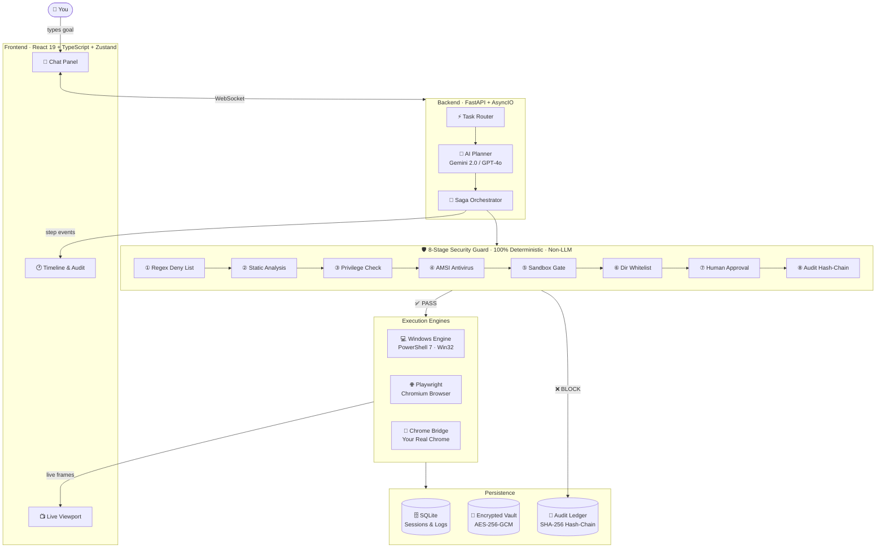

<div align="center">

<br/>

# ⚡ DirectAct-AI

**The only AI agent with a built-in security firewall.**

*Type a goal. Watch it happen. Nothing runs without your trust.*

<br/>

[](https://python.org)
[](https://fastapi.tiangolo.com)
[](https://react.dev)
[](https://typescriptlang.org)
[](https://playwright.dev)
[](LICENSE)

<br/>

[**Get Started →**](#-quick-start) · [**Architecture →**](#-architecture) · [**Security →**](#-security-model)

<br/>

</div>

---

## The Problem

Every AI agent today does the same dangerous thing — takes your instruction, generates a shell script, and runs it directly on your machine. No checks. No filters. No asking.

One bad prompt. One hallucination. Your files are gone.

---

## The Solution

DirectAct-AI puts a **deterministic 8-stage security firewall** between the AI's plan and your operating system. The LLM is only allowed to *plan* — it never touches your OS directly.

```
Your Goal  →  AI Plan  →  [ 8-Stage Guard ]  →  Execute  →  Watch Live
                              ↑
                     (not the LLM — pure logic,
                      regex, antivirus, & you)
```

Every step is verified, every action is audited, and anything risky **pauses and asks you first**.

---

## 🏗 Architecture



---

## ✨ Features

- **🔒 Zero raw code execution** — LLM outputs structured typed schemas, never shell scripts
- **🛡️ 8-stage security guard** — deterministic pipeline catches threats before they reach your OS
- **👁️ Live viewport streaming** — watch the browser operate in real time from your dashboard
- **🧩 Live Chrome Bridge** — control your real signed-in Chrome via CDP, no cookie theft
- **💻 Native Windows automation** — PowerShell 7, Win32 APIs, app registry, GDI screenshots
- **🔄 Saga rollback** — multi-step goals roll back cleanly if a step fails midway
- **⚡ LLM Circuit Breaker** — auto-rotates API keys on rate limits, zero downtime
- **🔐 Encrypted identity vault** — AES-256-GCM, master key lives only in your OS Keychain
- **📜 Tamper-proof audit log** — SHA-256 hash-chained JSONL — history cannot be edited
- **👥 Multi-user auth** — JWT sessions, bcrypt passwords, strict per-user data isolation

---

## 🛡️ Security Model

### How the 8-Stage Guard Works

| Stage | Name | What It Blocks |
|:---:|---|---|
| **①** | Regex Deny List | `rm -rf` `format c:` `shutdown` `del /s` PowerShell bypasses |
| **②** | Static Analysis | Hidden windows, obfuscated payloads, certutil/bitsadmin cradles |
| **③** | Privilege Check | `sudo` `runas` `net localgroup administrators` — any silent elevation |
| **④** | AMSI Antivirus | Native Windows Defender in-memory scan on every script buffer |
| **⑤** | Sandbox Gate | Unknown executables routed into Windows Sandbox disposable VM |
| **⑥** | Directory Whitelist | Writes blocked outside User home, `%TEMP%`, and your workspace |
| **⑦** | Human Approval | **You** get an Approve / Decline card for any medium-high risk action |
| **⑧** | Audit Hash-Chain | SHA-256 linked log written permanently — altering it breaks the chain |

### Encrypted Personal Vault

> The master key is generated once and stored in your **OS Keychain**. It never touches a file or database.

| Tier | Data | Access Rule |
|---|---|---|
| Routine | Name, language, preferences | Auto-approved |
| Contextual | Email, phone, address | Approved when task purpose matches |
| Identity | Document references | Manual confirmation required every single time |
| **Forbidden** | Passwords · Credit cards · CVVs · SSNs | **Hard-blocked at write time — forever** |

---

## 🚀 Quick Start

> **One command. That's it.**

```powershell
.\start.ps1
```

Installs everything, creates your `.env`, downloads Playwright's browser, and launches both servers.

| Service | URL |
|---|---|
| Dashboard | http://localhost:5173 |
| API & Docs | http://localhost:8000/docs |

<details>
<summary>Manual setup (click to expand)</summary>

**Backend**
```powershell
cd backend
python -m venv .venv && .\.venv\Scripts\Activate.ps1
pip install -r requirements.txt
python -m playwright install chromium
copy .env.example .env     # then add GEMINI_API_KEY
uvicorn app.main:app --port 8000 --reload
```

**Frontend** (new terminal)
```powershell
cd frontend
npm install && npm run dev
```

</details>

<details>
<summary>Chrome Extension setup (live session mode)</summary>

Lets DirectAct-AI operate inside your real signed-in Chrome (Gmail, GitHub, etc.):

1. Chrome → `chrome://extensions` → turn on **Developer mode**
2. **Load unpacked** → select the `chrome-extension/` folder
3. Check: `http://localhost:8000/api/v1/chrome/bridge-status` → `"connected": true` ✅

</details>

---

## ⚙️ Configuration

```env
# backend/.env  (copy from .env.example — never commit this file)

GEMINI_API_KEY=your_key_here        # Required · aistudio.google.com (free)
LLM_PROVIDER=gemini                 # or "openai"
OPENAI_API_KEY=optional             # Fallback if Gemini hits quota
SECRET_KEY=change-in-production     # JWT signing secret
BROWSER_HEADLESS=false              # false = you watch it · true = invisible
```

---

## 📁 Codebase Map

```
DirectAct-AI/
│
├── frontend/src/
│   ├── components/       ChatPanel · Timeline · Viewport · Sidebar
│   ├── pages/            Landing · Login · Signup
│   ├── store/            appStore · authStore (Zustand + Immer)
│   └── hooks/            useWebSocket.ts — real-time connection
│
├── backend/app/
│   ├── api/routes/       auth · sessions · chat · actions · chrome
│   └── services/
│       ├── security_guard.py    ← The 8-stage firewall
│       ├── orchestrator.py      ← Goal → steps → rollback
│       ├── os_engine.py         ← PowerShell + Win32
│       ├── web_engine.py        ← Playwright browser
│       ├── live_chrome_bridge.py← CDP Chrome bridge
│       ├── llm_service.py       ← Gemini/OpenAI + circuit breaker
│       ├── vault_service.py     ← AES-256 encrypted data
│       └── audit_log.py         ← SHA-256 hash-chain logger
│
├── chrome-extension/     Manifest V3 · chrome.debugger bridge
├── policies/             OPA Rego security rules
└── start.ps1             One-click launcher
```

---

## 🧰 Stack

| | Technology |
|---|---|
| **Frontend** | React 19 · TypeScript · Vite · Tailwind CSS · Zustand |
| **Backend** | Python 3.10 · FastAPI · AsyncIO · SQLAlchemy 2.0 |
| **AI Models** | Gemini 2.0 Flash · OpenAI GPT-4o · Circuit Breaker key rotation |
| **Browser** | Playwright Chromium · Chrome DevTools Protocol (CDP) |
| **OS Layer** | PowerShell 7 · Win32 APIs · pywinauto · psutil |
| **Security** | Windows AMSI · Open Policy Agent (Rego) · AES-256-GCM · bcrypt |
| **Storage** | SQLite async · SHA-256 hash-chained JSONL |

---

<div align="center">
<br/>

MIT License · Built by [Mihir M. Patwardhan](https://github.com/mihirmpatwardhan)

<br/>
</div>
