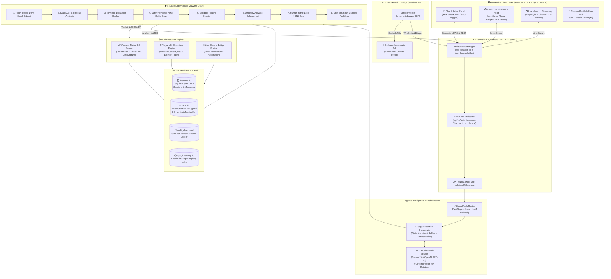
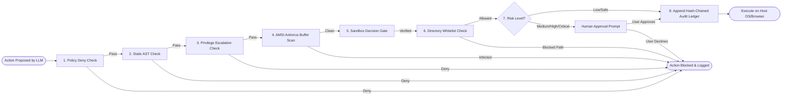
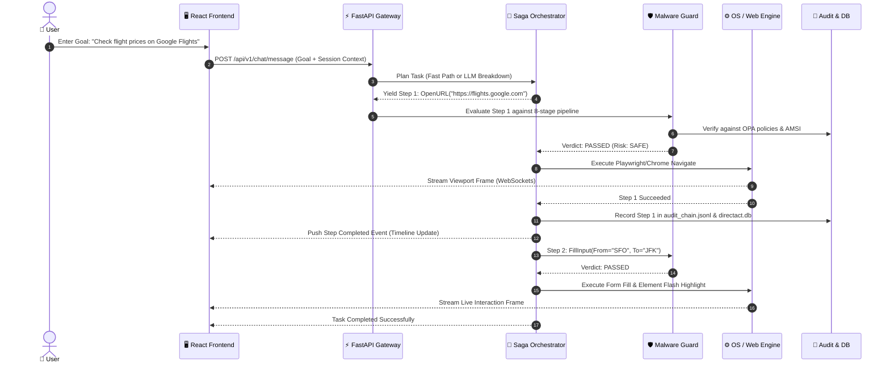

# DirectAct-AI (Lakshya Engine)

<div align="center">


**Transforming High-Level Natural Language Goals into Safe, Deterministic Autonomous Execution Across Desktop & Web**

[](https://fastapi.tiangolo.com)
[](https://react.dev)
[](https://www.typescriptlang.org)
[](https://vitejs.dev)
[](https://www.python.org)
[](https://playwright.dev)
[](https://microsoft.com)
[](LICENSE)

</div>

---

## 📖 Table of Contents
- [Overview & Vision](#-overview--vision)
- [System Architecture](#-system-architecture)
  - [High-Level Architecture Diagram](#high-level-architecture-diagram)
  - [8-Stage Deterministic Malware Guard Pipeline](#8-stage-deterministic-malware-guard-pipeline)
  - [Execution Flow Sequence Diagram](#execution-flow-sequence-diagram)
- [Key Features](#-key-features)
- [Technology Stack](#-technology-stack)
- [Execution Engines](#-execution-engines)
  - [1. Windows Native OS Engine](#1-windows-native-os-engine)
  - [2. Playwright Headless/Headed Engine](#2-playwright-headlessheaded-engine)
  - [3. Live Chrome Bridge Extension (CDP)](#3-live-chrome-bridge-extension-cdp)
- [Security & Zero-Trust Architecture](#-security--zero-trust-architecture)
  - [Purpose-Bound Encrypted Vault](#purpose-bound-encrypted-vault-vaultdb)
  - [Tamper-Evident Hash-Chained Audit Ledger](#tamper-evident-hash-chained-audit-ledger)
  - [AMSI & Antivirus Integration](#native-amsi-antivirus-scanning)
  - [Multi-User JWT Isolation](#multi-user-isolation--jwt-auth)
- [Directory Structure](#-directory-structure)
- [Getting Started](#-getting-started)
  - [Prerequisites](#prerequisites)
  - [One-Click Launch (Windows)](#one-click-launch-windows)
  - [Manual Setup](#manual-setup)
  - [Setting Up the Chrome Extension Bridge](#setting-up-the-chrome-extension-bridge)
- [Configuration & Environment Variables](#-configuration--environment-variables)
- [Security Notice & Disclaimer](#-security-notice--disclaimer)

---

## 🌟 Overview & Vision

**DirectAct-AI** (also known as the **Lakshya Engine**) is a next-generation autonomous desktop and web agent platform designed to translate high-level natural language requests into verified, auditable, and safe execution streams on host operating systems.

### The Problem with Traditional LLM Agents
Most agent frameworks invoke LLM-generated shell scripts, Python snippets, or uncontrolled browser drivers directly on the user's host OS. This introduces severe vulnerabilities:
- **Prompt Injection:** Attackers can hijack LLM behavior and run destructive terminal commands.
- **Hallucinated Syntax & Parameters:** Unchecked script generation risks deleting files or leaking system secrets.
- **Blind Execution:** Lack of deterministic privilege gating, sandboxing, and real-time antivirus inspection.

### The DirectAct-AI Solution: Deterministic Zero-Trust AI Execution
DirectAct-AI completely decouples **prompt intelligence** (LLM planning) from **host execution** (OS and browser drivers):

1. **Strict Action Vocabulary**: LLMs cannot generate freeform code or arbitrary shell commands. Prompts are translated into strictly typed, immutable Pydantic schema actions (`LaunchApp`, `CreateFile`, `OpenURL`, `ClickElement`, `FillInput`, etc.).
2. **Non-LLM 8-Stage Security Guard**: Every planned action must pass an 8-stage deterministic verification chain (Regex deny-lists, static AST inspection, Windows AMSI antivirus scanning, OPA Rego policies, and Human-in-the-Loop gates) before touching the operating system.
3. **Cryptographic Auditability**: Every decision is permanently written to a tamper-evident SHA-256 hash-chained ledger.
4. **Isolated Personal Vault**: Sensitive user data is encrypted with AES-256-GCM, with master keys safely held in the OS keychain.

---

## 🏛️ System Architecture

### High-Level Architecture Diagram



---

### 8-Stage Deterministic Malware Guard Pipeline

The Malware Guard is a **strict, non-LLM Chain of Responsibility** that inspects every single planned command before it reaches the operating system or browser:



1. **Stage 1: Policy Validation (<1ms)** — Instant regex deny-list matching. Blocks destructive disk formatting (`format c:`), recursive tree deletion (`rm -rf /`, `del /s /q`), OS shutdowns, and execution policy bypasses.
2. **Stage 2: Static Command Analysis** — Validates typed Action Vocabulary schemas and performs AST analysis for hidden windows, obfuscated payloads, and download cradles (`certutil`, `bitsadmin`).
3. **Stage 3: Privilege Escalation Check** — Completely denies automated elevation (`sudo`, `runas`, `net localgroup administrators`). Elevation must occur via native OS UAC prompts.
4. **Stage 4: Windows AMSI Antivirus Scan** — Uses Python `ctypes` to link directly into `amsi.dll`, feeding execution buffers through Windows Defender or installed host antivirus.
5. **Stage 5: Sandbox Decision** — Routes untrusted scripts or unknown executables into Windows Sandbox (`Containers-DisposableClientVM`).
6. **Stage 6: Directory Access Enforcement** — Restricts write access to safe user directories (User Home, `%TEMP%`, user workspace); strictly blocks writes to `C:\Windows` and `C:\Program Files`.
7. **Stage 7: Human-in-the-Loop (HITL) Gate** — High-impact actions pause execution, generating a interactive card in the UI with Diff previews, requiring one-click user sign-off.
8. **Stage 8: Cryptographic Audit Ledger** — Hashes decision context into an immutable SHA-256 chain log.

---

### Execution Flow Sequence Diagram



---

## 🚀 Key Features

- **🎯 Autonomous Goal Resolution:** Accepts high-level natural language instructions and coordinates multi-step desktop and browser automation without requiring code prompts.
- **🛡️ 8-Stage Deterministic Defense Chain:** Guarantees zero arbitrary code execution on host OS through non-LLM rule checks, AMSI scanning, and OPA policy evaluation.
- **🌐 Dual Browser Architecture:**
  - **Isolated Playwright Engine:** Autonomous headless or headed Chromium instances with live viewport streaming and DOM element highlight boxes.
  - **Live Chrome Extension Bridge (CDP):** Automates the user's authentic signed-in Chrome profile via official `chrome.debugger` APIs without exposing passwords, cookies, or profile files.
- **💻 Native Windows OS Automation:** Controls native desktop applications, Windows Registry lookups, Start Menu app discovery, and window management via PowerShell 7 and Win32 APIs.
- **🔄 Saga State Machine with Automatic Rollback:** Executes multi-step workflows with atomic consistency; triggers compensating reverse actions if an intermediate step fails.
- **⚡ LLM Circuit Breaker & Key Rotation:** Multi-key pooling across Google Gemini (`gemini-2.0-flash`, `gemini-1.5-flash`) and OpenAI (`gpt-4o-mini`) with automatic 60-second cooldown recovery on rate-limit HTTP 429 errors.
- **🔐 Encrypted Personal Data Vault:** AES-256-GCM encrypted identity storage for form-filling, secured by the OS Keychain, with a hard block on financial credentials.
- **📜 Tamper-Evident SHA-256 Audit Trail:** Cryptographically linked log verifying every security scan, user approval, and execution event.
- **👥 Multi-User Security & Isolation:** JWT-based user authentication, password hashing (`bcrypt`), and strict per-user database row scoping.

---

## 🛠️ Technology Stack

| Layer | Technologies | Purpose |
| :--- | :--- | :--- |
| **Backend Core** | Python 3.10+, FastAPI 0.111, Uvicorn, AsyncIO | High-concurrency asynchronous API gateway & event loop |
| **Frontend Core** | React 19, TypeScript 5+, Vite 8 | Reactive component UI with strict typing and lightning-fast HMR |
| **Frontend Styling** | Tailwind CSS 4, Modern Cyberpunk Glassmorphism | Responsive layout, dark mode aesthetic, smooth CSS transitions |
| **State Management** | Zustand 5, Immer | Centralized client-side immutable state with real-time sync |
| **Real-time Protocol**| WebSockets (`/ws/{session_id}`, `/ws/chrome-bridge`) | Bidirectional streaming of timeline events, logs & viewport frames |
| **Web Automation** | Playwright Chromium, Chrome DevTools Protocol (CDP) | Autonomous browser automation and live viewport streaming |
| **Chrome Extension** | Manifest V3, `chrome.debugger` API, Service Worker | Live-account web automation directly on user's active Chrome |
| **OS Automation** | PowerShell 7, Win32 APIs, `psutil`, `pywinauto` | Native Windows process launching, registry scans, and GDI captures |
| **Security & Policies**| Windows AMSI (`amsi.dll`), Open Policy Agent (Rego) | In-memory antivirus buffer inspection and declarative policy rules |
| **Cryptography** | AES-256-GCM (`cryptography`), Python `keyring` | Zero-knowledge encrypted personal vault backed by OS Keychain |
| **AI / LLM Engines** | Google Generative AI (`gemini-2.0-flash`), OpenAI API | Multi-provider intelligence with Circuit Breaker key failover |
| **Databases** | SQLite (`aiosqlite`, SQLAlchemy 2.0 Async ORM) | Persistence for users, sessions, conversation history, and actions |

---

## ⚙️ Execution Engines

### 1. Windows Native OS Engine
Implemented in `backend/app/services/os_engine.py`:
- Operates through PowerShell 7 in `-NoProfile -NonInteractive -ExecutionPolicy Bypass` mode.
- **Registry App Map:** Indexes canonical applications (Chrome, VS Code, Excel, Spotify, Calculator) via `HKLM\SOFTWARE\Microsoft\Windows\CurrentVersion\App Paths` and Start Menu shortcuts.
- **GDI Screen Capture:** Powers real-time desktop viewport captures using `System.Windows.Forms` and `System.Drawing.Graphics`.

### 2. Playwright Headless/Headed Engine
Implemented in `backend/app/services/web_engine.py`:
- Spawns persistent Chromium browser contexts.
- **Visual Feedback:** Injects a dynamic red outline (`outline: 3px solid #ef4444`) around DOM elements before clicking or filling.
- **Streaming Viewport:** Compresses frames as Base64 JPEG/WebP and pushes them over WebSockets to the React `ViewportPanel`.

### 3. Live Chrome Bridge Extension (CDP)
Located in `chrome-extension/`:
- Manifest V3 Chrome Extension powered by `chrome.debugger`.
- Connects automatically to `ws://127.0.0.1:8000/ws/chrome-bridge`.
- Controls a dedicated background tab in the user's authentic Chrome window.
- Allows the agent to interact with existing logins (Google, GitHub, Jira) safely **without extracting passwords, cookies, or profile data**.

---

## 🔒 Security & Zero-Trust Architecture

### Purpose-Bound Encrypted Vault (`vault.db`)
DirectAct-AI includes a secure identity store for user-authorized autofill:
- **Encryption:** Authenticated AES-256-GCM.
- **Key Isolation:** The master 256-bit key is generated once and stored in the host OS Keychain via `keyring` (`service="directact-ai"`, `key="vault_master_key"`). The key is never written to disk or the database.
- **Tiered Access Control:**
  - **Tier 1 (Routine):** Name, language, UI preferences (Auto-approved).
  - **Tier 2 (Contextual):** Email, phone, work address (Approved if task purpose matches).
  - **Tier 3 (Identity):** ID references, documents (Requires explicit per-use human confirmation).
  - **Strictly Forbidden:** Passwords, credit cards, CVVs, SSNs, and private keys are **hard-blocked at write time**.

### Tamper-Evident Hash-Chained Audit Ledger
Implemented in `backend/app/services/audit_log.py`:
- Every security decision produces an append-only JSONL record in `logs/audit_chain.jsonl`.
- Each record calculates:
  $$\text{entry\_hash} = \text{SHA-256}(\text{payload} + \text{prev\_hash})$$
- Modifying or deleting any historical log line breaks the cryptographic hash verification.
- Sensitive content is automatically redacted and logged only as its SHA-256 digest.

### Native AMSI Antivirus Scanning
DirectAct-AI links directly into Windows Antimalware Scan Interface (`amsi.dll`) via Python `ctypes`:
- All script blocks, PowerShell commands, and downloaded buffers are scanned in-memory by Windows Defender or active third-party antivirus before execution.
- Any payload returning a threat status ($\ge 32768$) is immediately aborted.

### Multi-User Isolation & JWT Auth
- All REST endpoints and WebSocket connections are protected by standard Bearer JWT tokens.
- Passwords are encrypted using `bcrypt`.
- Every database query scopes sessions, chat messages, and action logs strictly to the authenticated `user_id`.

---

## 📁 Directory Structure

```
DirectAct-AI/
├── .gitignore                      # Strict exclusion for .env, DBs, logs, caches
├── README.md                       # Main architecture & setup documentation
├── TECHNICAL_REPORT.md             # In-depth engineering & technical specification
├── MCP_SETUP.md                    # Setup guide for MCP browser engine
├── requirement.txt                 # Root Python requirements
├── start.ps1                       # One-click Windows launch script
│
├── backend/                        # FastAPI Backend Application
│   ├── app/
│   │   ├── api/                    # REST routes & WebSocket handlers
│   │   │   ├── routes/             # auth, chat, sessions, actions, chrome
│   │   │   └── router.py           # Master API router
│   │   ├── core/                   # Config, security utilities, DB engine, WS
│   │   ├── models/                 # SQLAlchemy 2.0 ORM models (User, Session, Action)
│   │   ├── schemas/                # Pydantic Action Vocabulary schemas & events
│   │   ├── services/               # Core engines:
│   │   │   ├── security_guard.py   # 8-stage Malware Guard pipeline
│   │   │   ├── amsi_scanner.py     # Native Windows AMSI scanner
│   │   │   ├── orchestrator.py     # Saga execution state machine
│   │   │   ├── task_router.py      # Fast-path intent classifier
│   │   │   ├── os_engine.py        # Windows PowerShell/Win32 engine
│   │   │   ├── web_engine.py       # Playwright browser engine
│   │   │   ├── live_chrome_bridge.py # WebSocket bridge to Chrome extension
│   │   │   ├── llm_service.py      # Gemini/OpenAI multi-provider + Circuit Breaker
│   │   │   ├── vault_service.py    # AES-256-GCM encrypted user vault
│   │   │   ├── audit_log.py        # SHA-256 hash-chained audit ledger
│   │   │   └── app_discovery.py    # Win32 application registry index
│   │   └── main.py                 # FastAPI application factory & lifespan
│   ├── requirements.txt            # Backend dependencies
│   └── .env.example                # Template configuration file
│
├── chrome-extension/               # Live Chrome Bridge Extension (Manifest V3)
│   ├── manifest.json               # Extension manifest (chrome.debugger permission)
│   ├── service_worker.js           # Background worker connecting to FastAPI WS
│   └── README.md                   # Extension installation guide
│
├── frontend/                       # React 19 + TypeScript Frontend
│   ├── src/
│   │   ├── components/             # UI Components:
│   │   │   ├── ChatPanel/          # User input, markdown rendering, prompt suggestions
│   │   │   ├── TimelinePanel/      # Real-time action steps, HITL cards, audit logs
│   │   │   ├── ViewportPanel/      # Live browser & desktop screen view
│   │   │   ├── ProfileSelector/    # Chrome profile selector
│   │   │   ├── Sidebar/            # Session history and system status
│   │   │   └── Navbar/             # Navigation and user auth controls
│   │   ├── pages/                  # Landing, Login, Signup, About, Contact
│   │   ├── store/                  # Zustand state stores (appStore, authStore)
│   │   ├── hooks/                  # useWebSocket.ts real-time connection hook
│   │   ├── lib/                    # Axios API clients
│   │   └── index.css               # Design system & dark cyberpunk styling
│   ├── package.json
│   └── vite.config.ts
│
└── policies/                       # Open Policy Agent (OPA) Rules
    ├── base.rego                   # General execution safety policies
    └── privilege.rego              # Privilege escalation restrictions
```

---

## 🚀 Getting Started

### Prerequisites
- **Operating System:** Windows 10 or 11 (64-bit recommended)
- **Python:** 3.10 or 3.11+
- **Node.js:** 18.0.0 or higher (with npm)
- **PowerShell:** PowerShell 5.1+ or PowerShell 7 (pwsh)
- **Google Chrome:** Installed for Live Extension Bridge or Playwright Chromium

---

### One-Click Launch (Windows)

DirectAct-AI includes a comprehensive PowerShell startup script that automatically checks prerequisites, initializes `.env`, installs backend & frontend dependencies, checks for Playwright Chromium, and starts both servers:

```powershell
.\start.ps1
```

Once running:
- **Frontend Dashboard:** [http://localhost:5173](http://localhost:5173)
- **Backend API Docs:** [http://localhost:8000/docs](http://localhost:8000/docs)
- **WebSocket Gateway:** `ws://localhost:8000/ws/{session_id}`

---

### Manual Setup

#### 1. Backend Setup

```powershell
# Navigate to backend directory
cd backend

# Create virtual environment (optional but recommended)
python -m venv .venv
.\.venv\Scripts\Activate.ps1

# Install Python dependencies
pip install -r requirements.txt

# Install Playwright Chromium browser binary
python -m playwright install chromium

# Create environment file from example
copy .env.example .env

# Edit .env and supply your GEMINI_API_KEY
notepad .env

# Start FastAPI server
uvicorn app.main:app --host 0.0.0.0 --port 8000 --reload
```

#### 2. Frontend Setup

```powershell
# Open a new terminal and navigate to frontend directory
cd frontend

# Install npm dependencies
npm install

# Start Vite development server
npm run dev
```

---

### Setting Up the Chrome Extension Bridge

The Chrome Extension allows DirectAct-AI to operate inside your existing signed-in Chrome session (e.g. Gmail, GitHub) without duplicating profiles or needing passwords:

1. Open Google Chrome.
2. Navigate to `chrome://extensions`.
3. Enable **Developer mode** (toggle in top-right corner).
4. Click **Load unpacked**.
5. Select the `DirectAct-AI/chrome-extension` directory.
6. Verify status at [http://127.0.0.1:8000/api/v1/chrome/bridge-status](http://127.0.0.1:8000/api/v1/chrome/bridge-status) — it should report `"connected": true`.

---

## ⚙️ Configuration & Environment Variables

Copy `backend/.env.example` to `backend/.env` and configure:

| Key | Default | Description |
| :--- | :--- | :--- |
| `LLM_PROVIDER` | `gemini` | Primary AI provider (`gemini` or `openai`) |
| `GEMINI_API_KEY` | *(Required)* | Google Gemini API key ([Get one here](https://aistudio.google.com/)) |
| `OPENAI_API_KEY` | *(Optional)* | OpenAI API key for fallback or secondary routing |
| `HOST` | `0.0.0.0` | Backend bind address |
| `PORT` | `8000` | Backend bind port |
| `DATABASE_URL` | `sqlite+aiosqlite:///./directact.db` | SQLAlchemy asynchronous database URL |
| `SECRET_KEY` | `change-this-in-production` | Secret key used for JWT signing |
| `ALLOWED_COMMANDS_WHITELIST` | `notepad,calc,explorer,chrome,msedge` | Allowed host processes |
| `VIRUSTOTAL_API_KEY` | *(Optional)* | API key for optional cloud binary lookup |
| `MCP_USE_SYSTEM_CHROME` | `true` | Enables system Chrome profile auto-detection |
| `BROWSER_HEADLESS` | `false` | Run Playwright Chromium in headed or headless mode |

---

## ⚠️ Security Notice & Disclaimer

> [!IMPORTANT]
> **Safety First:** DirectAct-AI executes real actions on your host operating system and web browser. While the built-in 8-Stage Malware Guard, AMSI Scanner, and Human-in-the-Loop gates block known destructive patterns and privilege escalations, always review critical/high-risk actions before confirming them.
>
> Never disable the confirmation gate when performing unfamiliar automation tasks.

---

## 📄 License

This project is licensed under the **MIT License**. See the [LICENSE](LICENSE) file for full details.

---

<div align="center">
Developed with ❤️ by <a href="https://github.com/mihirmpatwardhan">Mihir M. Patwardhan</a>
</div>
